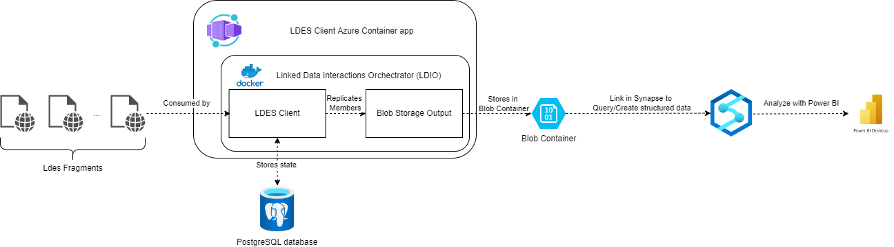

# VSDS-Client-Azure-Demo

This folder contains a set of Terraform manifest for deploying the VSDS LDESClient in Azure, using an Azure Container App which writes ldes members out to a blob Container in JSON format.
Using the included Azure Synapse Workspace it's possible to create for example views on the json files (structured data) which allows for analysis in Power BI.

**IMPORTANT:** As Power BI requires the data to be structured, the files need to be written out in JSON format and this requires a Context URI, e.g. https://private-api.gipod.beta-vlaanderen.be/api/v1/context/gipod.jsonld

A schematic overview of this set-up can be seen below:




## Quick start

### Deployment of LDES Client

To deploy the LDES client on Azure:

1. Modify `variables.tf` to choose the LDES Server you want to follow, add your user principal id (needed to access the data in the Analytics Workspace, ...)
2. Create a file `secret.tfvars` and store the database username and database password
```
db_username = "postgres"
db_password = "DemoVSDS123!"
```
3. Run `terraform init`.
3. Run `terraform apply -var-file="secret.tfvars"`.
4. Verify that the Azure Container App is Running and that members are written out to Azure Blob Storage

### Creation of a Power BI report

1. Open the Azure Analytics workspace
2. Create a database by executing: 
```sql
CREATE DATABASE Demo
```
3. Create a view on the database (note that you should change the database on which you are running the sql query in the interface from `master` to `Demo`)
```sql
CREATE VIEW demoView AS
SELECT
    JSON_VALUE(doc, '$.id') AS id,
    JSON_VALUE(doc, '$.createdBy.preferredName') AS organizer
FROM
    OPENROWSET(
            BULK 'https://demopowerquery.blob.core.windows.net/example',
            FORMAT = 'CSV',
            FIELDQUOTE = '0x0b',
            FIELDTERMINATOR ='0x0b',
            ROWTERMINATOR = '0x0b'
        )
        with (doc nvarchar(max)) as rows
```

4. Open Power BI and Connect to the created database (using the Serverless SQL Endpoint): `synapseclient-ondemand.sql.azuresynapse.net`
5. Load the data and create a report